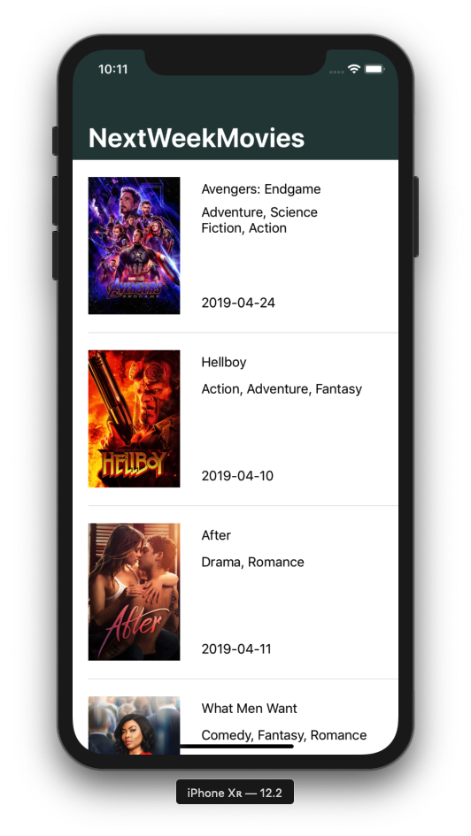
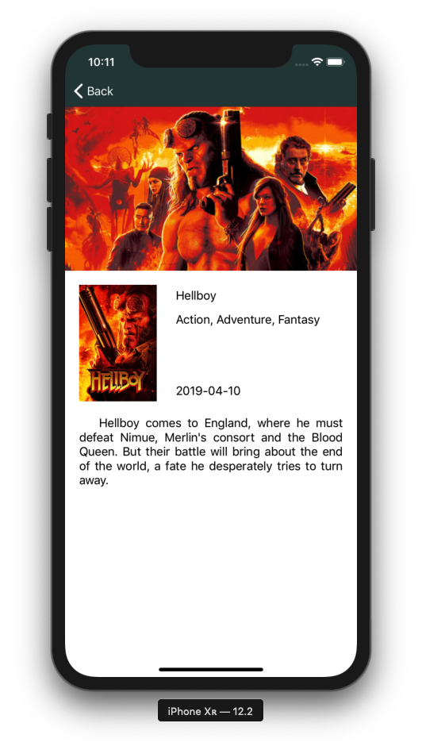

# NextWeekMovies

NextWeekMovies is an app used to get a list of upcoming movies and see their details. It uses [The Movie Database API](https://developers.themoviedb.org/3/getting-started/introduction) to fetch data. Made for iOS with Swift.




## Building and Running

NextWeekMovies uses [Cocoa Pods](https://cocoapods.org) with [Kingfisher](https://github.com/onevcat/Kingfisher) library to download movie images and store them locally. So, you have to install Cocoa Pods before building the project.

Once Cocoa Pods is installed, access the project root via terminal and run
```bash
    pod install
```
to install Kingfisher library.

Then, open the project workspace on Xcode and normally build and run NextWeekMovies on the iOS simulator of your choice (project tested only on iPhones running iOS 12.2).